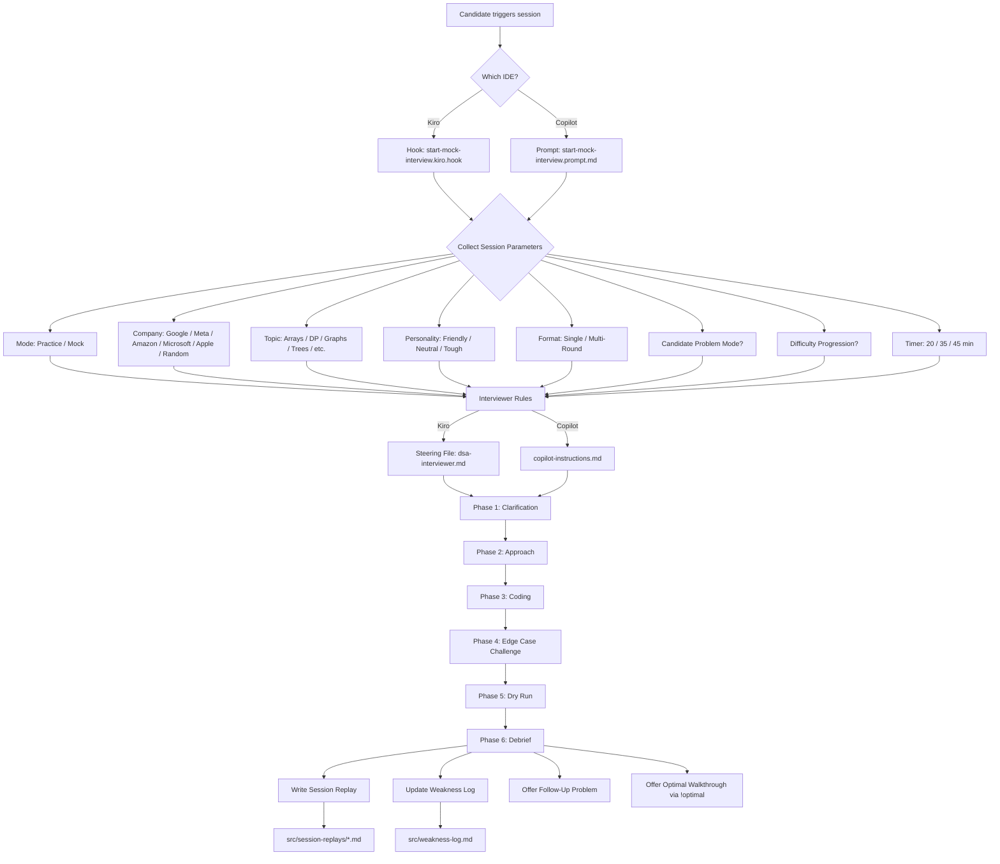
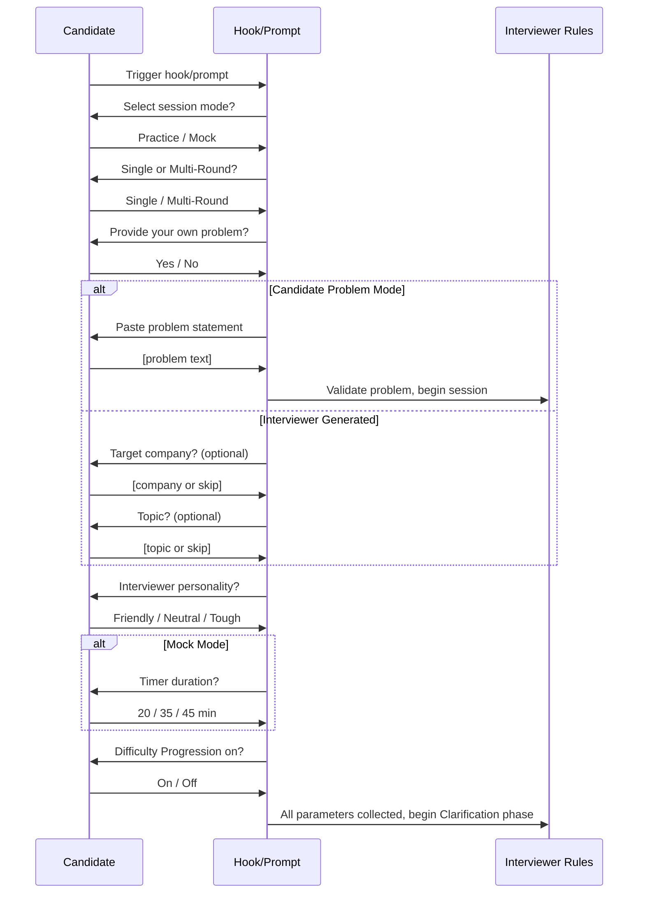

# Design Document: Interview Sim

## Overview

The Interview Sim transforms an AI-powered IDE's chat into a FAANG-level technical interviewer. It operates entirely within the IDE's chat interface using configuration files that define the interviewer persona and session rules.

**In Kiro**, this uses two core primitives:
1. A **steering file** (`.kiro/steering/dsa-interviewer.md`) that defines the Interviewer persona, session rules, phase logic, scoring rubrics, and all behavioural instructions — always active in Kiro chat.
2. A **user-triggered hook** (`.kiro/hooks/start-mock-interview.kiro.hook`) that initialises a session by collecting Candidate preferences and launching the interview flow.
3. Additional hooks for post-session saving and pace monitoring.

**In VS Code with GitHub Copilot**, the equivalent setup uses:
1. A **copilot-instructions file** (`.github/copilot-instructions.md`) containing the full interviewer rules.
2. **Reusable prompts** (`.github/prompts/`) for starting sessions and saving session data.

Both setups share the same reference documents under `.kiro/specs/dsa-mock-interviewer/ref/`.

There is no application code, no backend, no React. All session state (current phase, hint count, JS pitfalls detected, timer, etc.) is maintained conversationally by the Interviewer within the chat context. Persistent data (weakness log, session replays) is written to markdown files on disk.

### Key Design Decisions

- **Single steering file / instructions file**: All persona rules, phase definitions, scoring rubrics, company profiles, pitfall lists, and anti-pattern detection rules live in one file per IDE (`.kiro/steering/dsa-interviewer.md` for Kiro, `.github/copilot-instructions.md` for Copilot). This keeps the Interviewer's behaviour atomic and avoids fragmentation.
- **Shared reference documents**: Advanced features, company profiles, and multi-round rules live under `.kiro/specs/dsa-mock-interviewer/ref/` and are referenced by both Kiro hooks and Copilot prompts.
- **Conversational state management**: Session state (phase, hint count, timer, pitfalls) is tracked within the chat context rather than in external files. This is the natural model for AI-driven chat — the AI maintains context across turns.
- **Persistent files for cross-session data only**: The weakness log and session replays are the only files written to disk, because they need to survive across sessions.
- **Hook/prompt as session bootstrapper**: The hook (Kiro) or prompt (Copilot) collects all session parameters (mode, company, topic, personality, difficulty progression, candidate problem) in a structured flow, then hands off to the steering/instructions file's phase logic.

---

## Architecture

The feature has two IDE-specific configuration layers, shared reference documents, and two persistent file stores:



### Component Interaction Flow

1. **Candidate triggers the session** → Hook (Kiro) or Prompt (Copilot) prompts for session parameters.
2. **Parameters collected** → The interviewer rules (steering file or copilot-instructions) drive problem generation/acceptance and begin the Clarification phase.
3. **Interviewer rules drive all six phases** → Each phase has entry/exit conditions, behavioural rules, and transition logic.
4. **Debrief completes** → The interviewer writes the session replay file, updates the weakness log, and offers follow-up/optimal walkthrough.

---

## Components and Interfaces

### Component 1: Interviewer Rules

The interviewer rules are the core component. They define everything the Interviewer needs to behave correctly.

**In Kiro:** `.kiro/steering/dsa-interviewer.md` (steering file, always active in chat)
**In Copilot:** `.github/copilot-instructions.md` (workspace instructions, always active in chat)

Both files contain the same rules. The Kiro steering file is the source of truth; the Copilot instructions file is a standalone equivalent.

#### Sections within the Interviewer Rules

| Section | Purpose | Requirements Covered |
|---|---|---|
| **Persona Definition** | SDE-2 FAANG interviewer identity, Socratic style, no-solution-giving rule | Req 1.1, 1.2, 1.7 |
| **Session Modes** | Practice_Mode vs Mock_Mode behavioural differences | Req 1.5, 1.6, 4.3, 4.4, 15.5 |
| **Phase Definitions** | Six phases with entry/exit conditions and transition rules | Req 1.3, 3.1–3.11 |
| **Hint System Rules** | `!hint` command, Socratic nudges, mode-specific limits, progressive hints | Req 4.1–4.5 |
| **Pushback Rules** | When and how to challenge the Candidate | Req 5.1–5.5 |
| **JS Pitfall Detection** | List of pitfalls, detection rules, flagging behaviour | Req 6.1–6.4 |
| **Timer Rules** | Mock_Mode timer logic, reminders, expiry behaviour | Req 7.1–7.5 |
| **Debrief Rubric** | Seven scoring dimensions, verdict logic, pace report, anti-pattern summary, communication tips | Req 8.1–8.8 |
| **Company Profiles** | Per-company topic preferences and evaluation emphasis | Req 9.1–9.6 |
| **State Tracking Rules** | Phase tracking, hint count, pitfall count, approach reference | Req 10.1–10.5 |
| **Follow-Up Problem Rules** | When to offer, condensed session format, constraint escalation | Req 11.1–11.5 |
| **Think Aloud Evaluation** | Sub-criteria, prompting rules, silent coding detection | Req 12.1–12.5 |
| **Dry Run Rules** | Test input generation, variable tracing, discrepancy detection | Req 13.1–13.7 |
| **Pattern Recognition** | Post-debrief pattern identification, similar problem suggestions | Req 14.1–14.5 |
| **Communication Anti-Pattern Detection** | Anti-pattern list, real-time vs debrief-only flagging by mode | Req 15.1–15.5 |
| **Candidate Problem Mode** | Validation rules for user-provided problems | Req 16.1–16.5 |
| **Multi-Round Session** | Three-round structure, per-round debrief, cumulative debrief | Req 17.1–17.6 |
| **Weakness Log Integration** | Read on session start, write after debrief, recurring weakness detection | Req 18.1–18.5 |
| **Optimal Solution Walkthrough** | `!optimal` command, pre-debrief guard, divergence analysis | Req 19.1–19.5 |
| **Pace Coaching** | Phase timing tracking, benchmark comparison, over/under flags | Req 20.1–20.5 |
| **Difficulty Progression** | Adaptive difficulty rules based on past verdicts and hint usage | Req 21.1–21.6 |
| **Edge Case Challenge Rules** | 3-4 edge cases, prediction-first format, accuracy scoring | Req 22.1–22.7 |
| **Session Replay Generation** | Post-debrief file generation, naming convention, content structure | Req 23.1–23.5 |
| **Interviewer Personality** | Three personality variants, tone rules, consistency requirement | Req 24.1–24.7 |
| **Special Commands** | `!hint`, `!reveal`, `!optimal`, `!restart` command definitions | Req 1.2, 4.2, 10.4, 19.1 |

### Component 2: Session Initialisation

The session bootstrapper collects parameters and kicks off the interview.

**In Kiro:** `.kiro/hooks/start-mock-interview.kiro.hook` (user-triggered hook)
**In Copilot:** `.github/prompts/start-mock-interview.prompt.md` (reusable prompt)

#### Hook/Prompt Structure

```markdown
---
trigger: user
description: Start a DSA mock interview session
---

## Instructions

1. Read the weakness log at `src/weakness-log.md` if it exists.
2. Prompt the Candidate to select:
   a. Session mode: Practice_Mode or Mock_Mode
   b. Session format: Single session or Multi_Round_Session
   c. Problem source: Interviewer-generated or Candidate_Problem_Mode
   d. Target company: Google, Meta, Amazon, Microsoft, Apple, or Random (optional)
   e. Topic: Arrays, DP, Graphs, Trees, Strings, Linked Lists, Backtracking, Heap, or Random (optional)
   f. Interviewer personality: Friendly, Neutral, or Tough (default: Neutral)
   g. Difficulty Progression: On or Off (default: Off)
   h. Timer duration (Mock_Mode only): 20, 35, or 45 minutes
3. If Candidate_Problem_Mode is selected, prompt the Candidate to paste the problem.
4. If Difficulty_Progression is On, read the weakness log to determine the appropriate difficulty level.
5. Begin the session by generating/accepting the problem and entering the Clarification phase.
```

#### Parameter Collection Flow



### Component 2a: Post-Session Save (Kiro: hook, Copilot: prompt)

**In Kiro:** `.kiro/hooks/post-session-save.kiro.hook` (triggered on agent stop)
**In Copilot:** `.github/prompts/save-session.prompt.md` (manually triggered after debrief)

### Component 2b: Pace Monitor (Kiro only)

**In Kiro:** `.kiro/hooks/phase-pace-monitor.kiro.hook` (triggered on every prompt submit)
**In Copilot:** Pace coaching rules are embedded directly in `copilot-instructions.md` since Copilot does not support auto-triggered hooks on every message.

### Component 3: Weakness Log File (`src/weakness-log.md`)

A persistent markdown file that accumulates weakness data across sessions.

### Component 4: Session Replay Files (`src/session-replays/*.md`)

Per-session markdown summaries written after each debrief.

---

## Data Models

### Session Parameters (Collected by Hook)

| Parameter | Type | Values | Default | Required |
|---|---|---|---|---|
| `mode` | enum | `Practice`, `Mock` | — | Yes |
| `format` | enum | `Single`, `MultiRound` | `Single` | Yes |
| `problemSource` | enum | `Generated`, `CandidateProvided` | `Generated` | Yes |
| `company` | enum | `Google`, `Meta`, `Amazon`, `Microsoft`, `Apple`, `Random` | `Random` | No |
| `topic` | enum | `Arrays`, `DP`, `Graphs`, `Trees`, `Strings`, `LinkedLists`, `Backtracking`, `Heap`, `Random` | `Random` | No |
| `personality` | enum | `Friendly`, `Neutral`, `Tough` | `Neutral` | No |
| `difficultyProgression` | boolean | `On`, `Off` | `Off` | No |
| `timerDuration` | enum | `20`, `35`, `45` (minutes) | — | Mock only |

### Session State (Maintained in Chat Context)

| Field | Type | Description |
|---|---|---|
| `currentPhase` | enum | One of: `Clarification`, `Approach`, `Coding`, `EdgeCaseChallenge`, `DryRun`, `Debrief` |
| `hintCount` | integer | Running count of `!hint` commands used |
| `jsPitfallsDetected` | list | Each entry: `{line, pitfallCategory, corrected: boolean}` |
| `communicationAntiPatterns` | list | Each entry: `{type, count}` |
| `phaseTimings` | map | Phase name → approximate duration |
| `candidateApproach` | text | The Candidate's stated approach (for reference in pushbacks) |
| `problemTitle` | text | Title of the current problem |
| `problemDifficulty` | enum | `Easy`, `Medium`, `Hard` |
| `edgeCaseResults` | list | Each entry: `{edgeCase, candidatePrediction, correct: boolean}` |
| `dryRunAccurate` | boolean | Whether the Candidate's trace matched code behaviour |

### Problem Format (Generated or Validated)

```markdown
## [Problem Title]
**Difficulty:** Easy / Medium / Hard
**Topics:** [Array, DP, etc.]
**Company Tag:** [Google, Meta, etc. — if applicable]

### Problem Statement
[Clear description of the problem]

### Examples
**Example 1:**
- Input: [input]
- Output: [output]
- Explanation: [explanation]

**Example 2:**
- Input: [input]
- Output: [output]
- Explanation: [explanation]

### Constraints
- [constraint 1]
- [constraint 2]
- ...
```

### Debrief Scorecard Format

```markdown
📊 Debrief — [Problem Title]
Mode: [Practice/Mock] | Personality: [variant] | Company: [if selected]

┌─────────────────────────────────┬───────┬────┐
│ Dimension                       │ Score │    │
├─────────────────────────────────┼───────┼────┤
│ Approach Quality                │  X/5  │ ✅ │  [one-sentence justification]
│ Time/Space Complexity Accuracy  │  X/5  │ ✅ │  [one-sentence justification]
│ Edge Case Coverage              │  X/5  │ ⚠️ │  [one-sentence justification]
│ Communication & Fluency         │  X/5  │ ❌ │  [one-sentence justification]
│ Clarifying Questions Quality    │  X/5  │ ✅ │  [one-sentence justification]
│ Think Aloud                     │  X/5  │ ⚠️ │  [one-sentence justification]
│ Code Narration Quality          │  X/5  │ ✅ │  [one-sentence justification]
└─────────────────────────────────┴───────┴────┘

Average: X.X/5  ████████░░

🟢 Verdict: HIRE / 🟡 Verdict: BORDERLINE / 🔴 Verdict: NO HIRE

Hints Used: [count]

<details>
<summary>💬 Communication Tips</summary>

1. [Specific, actionable tip for improving communication and fluency]
2. [Specific, actionable tip]

</details>

<details>
<summary>🧪 Edge Case Analysis</summary>

**Accuracy:** [X/Y correct on listed cases]

**Missed Edge Cases:**
- [edge case 1 the Candidate failed to identify]
- [edge case 2 the Candidate failed to identify]

</details>

<details>
<summary>⏱️ Pace Report</summary>

| Phase | Candidate Time | Benchmark | Status |
|---|---|---|---|
| Clarification | Xm | 3-5m | ✅ On Track / ⚠️ Over Time / ⚠️ Rushed |
| Approach | Xm | 5-8m | ✅ On Track / ⚠️ Over Time / ⚠️ Rushed |
| Coding | Xm | 15-20m | ✅ On Track / ⚠️ Over Time / ⚠️ Rushed |
| Dry Run | Xm | 3-5m | ✅ On Track / ⚠️ Over Time / ⚠️ Rushed |

**Time Management Note (Mock_Mode only):**
[Whether Candidate completed within allotted time]

</details>

<details>
<summary>🐛 JS Pitfalls</summary>

- [pitfall 1]: [corrected ✅ / not corrected ❌]
- ...

</details>

<details>
<summary>🗣️ Communication Anti-Patterns</summary>

- [anti-pattern type]: [count] occurrences — [suggestion]
- ...

</details>

<details>
<summary>🧠 Think-Aloud Analysis</summary>

**Dry Run Accuracy:** [Accurate ✅ / Inaccurate ❌ / Incomplete ⚠️ — brief note]

**Strong moment:** [quote/paraphrase]
**Weak moment:** [quote/paraphrase]

</details>

<details>
<summary>🔗 DSA Pattern & Similar Problems</summary>

**Primary Pattern:** [pattern name] — [one-sentence explanation]

**Similar Problems:**
- [Problem Title] ([Difficulty])
- [Problem Title] ([Difficulty])
- [Problem Title] ([Difficulty])

</details>

<details>
<summary>🏢 Company-Specific Feedback</summary>

[Feedback referencing the selected company's evaluation style, or "No company selected" if N/A]

</details>

<details>
<summary>📈 Improvement Suggestions</summary>

1. [Specific, actionable suggestion]

</details>
```

### Weakness Log Entry Format

```markdown
## Session: [Date] — [Problem Title]

**Difficulty:** [Easy/Medium/Hard] | **Mode:** [Practice/Mock] | **Verdict:** [Hire/Borderline/No Hire]

### Weak Areas
- **Category:** [e.g., "Graph Traversal Edge Cases"]
  - Status: [new / recurring / improving / resolved]
  - Scoring dimensions rated ≤3: [list]
  - Communication anti-patterns: [list]
  - Specific observation: [one sentence]
```

### Session Replay Format

```markdown
# Session Replay: [Problem Title]

**Date:** [YYYY-MM-DD]
**Mode:** Practice / Mock | **Company:** [if selected] | **Personality:** [variant]
**Problem:** [title] ([difficulty])

## Problem Statement
[Condensed problem statement]

## Candidate's Approach
[Summary of stated approach]

## Key Decisions & Pivots
- [Decision/pivot 1]
- [Decision/pivot 2]

## Mistakes & Corrections
- [Mistake 1] → [Correction]

## Key Exchanges
[2–3 verbatim or near-verbatim moments from the session]

**[Type]: [one-line summary]**
> Candidate: "[what they said/wrote]"
> Interviewer: "[the challenge/hint/prompt]"
> Candidate: "[how they responded]"
> Outcome: [one sentence]

## Hints Requested
1. [Hint request context] → [Hint given]

## JS Pitfalls
- [Pitfall]: [corrected/not corrected]

## Debrief Scores
[Full scorecard as defined above]

## Pace Report
[Phase timing table]

## Verdict: [Hire / Borderline / No Hire]
```

### Multi-Round Cumulative Debrief Format

```markdown
## Multi-Round Cumulative Debrief

### Round Summaries
| Round | Problem | Difficulty | Verdict | Avg Score |
|---|---|---|---|---|
| 1 | [title] | Easy-Medium | [verdict] | [avg] |
| 2 | [title] | Medium-Hard | [verdict] | [avg] |
| 3 | [title] | Hard | [verdict] | [avg] |

### Score Trends
| Dimension | Round 1 | Round 2 | Round 3 | Trend |
|---|---|---|---|---|
| Approach Quality | X | X | X | ↑/↓/→ |
| ... | ... | ... | ... | ... |

### Stamina Assessment
[Consistent / Improved / Degraded — with explanation]

### Overall Multi-Round Verdict: [Hire / Borderline / No Hire]

### Cumulative Improvement Suggestions
1. [Suggestion spanning all rounds]
```


---

## Correctness Properties

*A property is a characteristic or behavior that should hold true across all valid executions of a system — essentially, a formal statement about what the system should do. Properties serve as the bridge between human-readable specifications and machine-verifiable correctness guarantees.*

### Nature of This Feature

This is a feature where the "system" is an AI model guided by configuration files (steering file, copilot-instructions, hooks, prompts). Most acceptance criteria describe AI conversational behaviour (e.g., "the Interviewer SHALL ask clarifying questions"), which is inherently non-deterministic and not amenable to automated property testing. However, several requirements define deterministic rules about data formats, threshold logic, and pure functions that can be extracted and tested.

The testable properties below focus on the deterministic, computable aspects of the feature.

### Property 1: Problem Statement Validation

*For any* problem statement (whether generated by the Interviewer or provided by the Candidate), the validation function should accept it if and only if it contains a non-empty problem description and at least one example with both input and output.

**Validates: Requirements 2.8, 16.3**

### Property 2: Weakness Category Threshold Detection

*For any* weakness log containing entries grouped by category, if a category appears in three or more entries, the recommendation function should flag that category for focused practice. If a category appears in fewer than three entries, it should not be flagged.

**Validates: Requirements 18.5**

### Property 3: Pace Report Phase Classification

*For any* phase duration and its corresponding benchmark range (lower bound, upper bound), the classification function should return "Over Time" when the duration exceeds 150% of the upper bound, "Rushed" when the duration is below 50% of the lower bound, and "On Track" otherwise. The benchmarks are: Clarification (3–5 min), Approach (5–8 min), Coding (15–20 min), Dry Run (3–5 min).

**Validates: Requirements 20.2, 20.3, 20.4**

### Property 4: Difficulty Progression Computation

*For any* tuple of (previous verdict, hint count, current difficulty), the next difficulty should be computed as follows: if verdict is "Hire" and hints ≤ 1, escalate by one level; if verdict is "No Hire" or hints ≥ 3, de-escalate by one level; if verdict is "Borderline", maintain the same level. The result should always be clamped to the range [Easy, Hard] — never escalating beyond Hard or de-escalating below Easy.

**Validates: Requirements 21.2, 21.3, 21.4, 21.6**

### Property 5: Edge Case Accuracy Computation

*For any* list of edge case results (each being a pair of candidate prediction and actual correctness), the edge case accuracy score should equal the count of correct predictions divided by the total number of edge cases presented.

**Validates: Requirements 22.6**

### Property 6: Session Replay Filename Format

*For any* session date (YYYY-MM-DD) and problem title, the generated session replay filename should match the pattern `{date}-{problem-title-kebab-case}.md`, where the problem title is converted to lowercase kebab-case (spaces and special characters replaced with hyphens, consecutive hyphens collapsed).

**Validates: Requirements 23.2**

### Property 7: Session Replay Line Count Invariant

*For any* generated session replay file, the total line count should not exceed 150 lines.

**Validates: Requirements 23.4**

---

## Error Handling

Since this feature operates entirely through Kiro's chat interface with no application code, "errors" manifest as conversational edge cases rather than runtime exceptions.

### Steering/Instructions File Errors

| Scenario | Handling |
|---|---|
| Configuration file is missing or malformed | The IDE will not load the interviewer persona. Verify the file exists at `.kiro/steering/dsa-interviewer.md` (Kiro) or `.github/copilot-instructions.md` (Copilot). |
| Instructions conflict | The configuration file should be written with explicit priority rules (e.g., "Mock_Mode rules override Practice_Mode rules when both could apply"). |

### Hook/Prompt Errors

| Scenario | Handling |
|---|---|
| Hook/prompt file is missing | The Candidate cannot trigger the session. Verify the file exists at `.kiro/hooks/start-mock-interview.kiro.hook` (Kiro) or `.github/prompts/start-mock-interview.prompt.md` (Copilot). |
| Candidate provides invalid selections | The hook instructions should include validation prompts — if the Candidate provides an unrecognised option, the Interviewer re-prompts with the valid options. |
| Candidate provides incomplete problem in Candidate_Problem_Mode | The Interviewer validates the problem (per Property 1) and requests missing information before proceeding. |

### Session State Errors

| Scenario | Handling |
|---|---|
| Candidate tries to skip phases | The steering file instructs the Interviewer to enforce phase ordering. If the Candidate tries to jump to coding, the Interviewer redirects to the current phase. |
| Candidate types `!optimal` before Debrief | The Interviewer informs the Candidate that the walkthrough is available only after the Debrief (Req 19.4). |
| Candidate types `!hint` after Mock_Mode limit reached | The Interviewer declines and states the hint limit has been reached (Req 4.3). |
| Candidate requests restart mid-session | The Interviewer confirms, resets hint count to zero, and re-triggers initialisation (Req 10.4). |

### File I/O Errors

| Scenario | Handling |
|---|---|
| Weakness log doesn't exist on first session | The Interviewer creates the file on first write. On read, absence means no prior weaknesses — proceed normally. |
| Session replays directory doesn't exist | The Interviewer creates the directory before writing the replay file. |
| Weakness log is malformed | The Interviewer should attempt to parse what it can and note any parsing issues. It should not fail the session due to a corrupted weakness log. |

---

## Testing Strategy

### Nature of Testing

This feature has no application code — it consists of markdown files (steering/instructions files, hooks/prompts, weakness log, session replays) and AI-driven conversational behaviour. Testing falls into two categories:

1. **Structural validation** (automated): Verify that the configuration files and generated files conform to their required formats and contain all required content.
2. **Behavioural validation** (manual): Verify that the Interviewer follows the rules during live sessions. This requires human review of session transcripts.

### Unit Tests (Example-Based)

Unit tests should verify specific structural and content requirements:

| Test | What It Verifies | Requirement |
|---|---|---|
| Steering file exists at `.kiro/steering/dsa-interviewer.md` | Kiro config file location | Req 1.1 |
| Copilot instructions exist at `.github/copilot-instructions.md` | Copilot config file location | Req 1.1 |
| Steering file contains all six phase names in order | Phase definition | Req 1.3 |
| Steering file lists all five JS pitfall categories | Pitfall coverage | Req 6.1 |
| Hook file exists at `.kiro/hooks/start-mock-interview.kiro.hook` | Kiro hook configuration | Req 2.1 |
| Copilot prompt exists at `.github/prompts/start-mock-interview.prompt.md` | Copilot prompt configuration | Req 2.1 |
| Hook/prompt contains Multi_Round_Session option with three rounds | Multi-round structure | Req 17.2 |
| Weakness log path is `src/weakness-log.md` | File location | Req 18.1 |
| Default personality is Neutral when none selected | Default value | Req 24.2 |
| First difficulty progression session starts at Medium | Initial difficulty | Req 21.1 |

### Property-Based Tests

Property-based tests should use a PBT library (e.g., `fast-check` for JavaScript) with a minimum of 100 iterations per test. Each test should be tagged with a comment referencing the design property.

| Property Test | Design Property | Tag |
|---|---|---|
| Problem validation accepts/rejects based on required fields | Property 1 | `Feature: dsa-mock-interviewer, Property 1: Problem Statement Validation` |
| Weakness threshold flags categories with ≥3 entries | Property 2 | `Feature: dsa-mock-interviewer, Property 2: Weakness Category Threshold Detection` |
| Pace classification returns correct status for any duration/benchmark | Property 3 | `Feature: dsa-mock-interviewer, Property 3: Pace Report Phase Classification` |
| Difficulty progression computes correct next difficulty | Property 4 | `Feature: dsa-mock-interviewer, Property 4: Difficulty Progression Computation` |
| Edge case accuracy equals correct/total | Property 5 | `Feature: dsa-mock-interviewer, Property 5: Edge Case Accuracy Computation` |
| Replay filename matches date-kebab pattern | Property 6 | `Feature: dsa-mock-interviewer, Property 6: Session Replay Filename Format` |
| Replay file never exceeds 150 lines | Property 7 | `Feature: dsa-mock-interviewer, Property 7: Session Replay Line Count Invariant` |

### Manual Testing Checklist

Since most requirements govern AI conversational behaviour, manual testing is essential:

- Run a full Practice_Mode session and verify all six phases occur in order
- Run a full Mock_Mode session with timer and verify time reminders appear
- Test `!hint` command in both modes (verify limit in Mock_Mode)
- Test `!reveal` command
- Test `!optimal` command before and after Debrief
- Verify Debrief contains all seven scoring dimensions with 1-5 ratings
- Verify company-specific problem selection for each company
- Test Candidate_Problem_Mode with valid and incomplete problems
- Run a Multi_Round_Session and verify cumulative debrief
- Verify weakness log is created and updated across sessions
- Verify session replay is saved with correct filename and content
- Test all three personality variants
- Test difficulty progression across multiple sessions
- Verify JS pitfall detection on code with known pitfalls
- Verify communication anti-pattern detection in both modes
